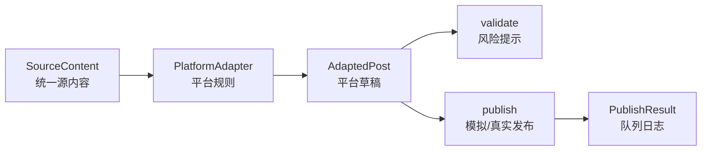

# All Right

多平台内容发布工具 MVP。创作者维护一份源内容，系统按公众号、知乎、B站、小红书的规则生成平台草稿，并支持一键模拟发布、发布日志、失败重试和历史记录。

## 功能

- Markdown 内容工作台：标题、正文、标签、封面、语气、目标读者
- 平台适配器：公众号、知乎、B站、小红书
- 平台预览：标题、摘要、正文、标签、字数、风险提示
- 模拟发布：队列状态、执行日志、历史记录、失败重试
- 草稿流转：复制当前平台草稿、下载 JSON 草稿包
- 可选 AI 增强：配置 `OPENAI_API_KEY` 或 `OPENROUTER_API_KEY` 后启用
- 扩展架构页：新增平台模板、真实发布接入路径、三天交付边界

## 本地运行

```bash
npm install
npm run dev
```

打开 `http://localhost:3000`。

## 验证命令

```bash
npm run test
npm run lint
npm run build
```

## AI 增强配置

本地规则模板不依赖任何 Key。需要 AI 改写时，创建 `.env.local`：

```bash
OPENAI_API_KEY=your_key
# 或
OPENROUTER_API_KEY=your_key
AI_MODEL=gpt-4.1-mini
```

## 核心架构



### 关键接口

- `SourceContent`: 原始标题、正文、标签、封面、语气、目标读者
- `PlatformAdapter`: 平台能力、约束、适配、校验、发布
- `AdaptedPost`: 平台化标题、摘要、正文、标签、统计、风险提示
- `PublishResult`: 平台、状态、模拟链接、耗时、错误、日志

### 新增平台

在 `src/lib/adapters.ts` 中新增一个 `PlatformAdapter`：

```ts
export const newPlatform: PlatformAdapter = {
  id: "new-platform",
  label: "新平台",
  shortLabel: "新平台",
  description: "平台风格说明",
  capabilities,
  constraints,
  adapt(source) {
    return createPost(...);
  },
  validate(post) {
    return buildWarnings(post, constraints);
  },
  publish(post) {
    return simulatePublish(post);
  },
};
```

真实发布可以把 `publish` 替换为 Playwright 草稿写入、Wechatsync CLI/MCP 调用，或官方 API 调用。首版默认模拟发布，避免 3 天议题实战受登录态、验证码和平台风控影响。

更多细节见：

- [架构设计](docs/ARCHITECTURE.md)
- [Demo 脚本](docs/DEMO_SCRIPT.md)
- [Issue 拆解](docs/ISSUE_BREAKDOWN.md)

## Demo 脚本

1. 打开首页，确认四个平台都已选中。
2. 修改源标题或正文，观察平台预览和风险提示实时变化。
3. 使用热点选题导入一个大纲。
4. 复制或下载当前平台草稿。
5. 点击“一键模拟发布”，展示四个平台队列、日志和历史记录。
6. 切到“扩展架构”，说明新增平台只需要实现 adapter。

## 参考项目取舍

- SYNAPSEAUTOMATION：借鉴任务调度和执行回收思路。
- Wechatsync：借鉴本地浏览器登录态、草稿优先和平台适配器。
- turbopush-website：借鉴 Markdown 编辑、多平台模板和产品展示方式。
- yupi-hot-monitor：借鉴热点输入源。
- ai-passage-creator：借鉴内容生成链路。

没有复制 GPL 项目代码，首版只保留可演示的产品闭环和可扩展接口。
