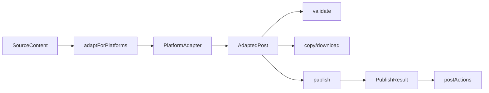

# 架构设计

All Right 的核心是“源内容一次维护，平台 adapter 负责差异化输出”。

## 数据流

## 核心接口

- `SourceContent`: 标题、正文、标签、封面、语气、目标读者。
- `PlatformAdapter`: 平台能力、约束、适配、校验、发布函数和发布后操作能力。
- `AdaptedPost`: 平台草稿，包含标题、摘要、正文、标签、统计和 warnings。
- `PublishResult`: 发布任务状态、日志、外部帖子 ID、模拟链接和错误信息。

## 新增平台

1. 在 `src/types/content.ts` 扩展 `PlatformId`。
2. 在 `src/lib/adapters.ts` 增加平台 constraints 和 adapter。
3. 在 adapter 的 `adapt` 中完成标题、正文、标签的风格化。
4. 在 `validate` 中复用平台约束和源内容风险提示。
5. 首版可复用 `simulatePublish`，真实发布时替换 `publish`。

## 发布后操作

发布结果会保留 `externalPostId` 和日志，首版支持成功任务的模拟撤回。真实平台接入时，这一层不应该默认所有平台都可撤回，而是由 adapter 的 `capabilities.postActions` 控制：

- `edit`: 平台是否允许发布后编辑或草稿覆盖。
- `withdraw`: 平台是否允许撤回、下架或删除已发布内容。
- `delete`: 平台是否允许删除远端草稿或发布记录。

如果平台不支持撤回，前端应展示“需到平台手动处理”，并保留发布日志，避免给用户错误承诺。

## 真实发布策略

优先级建议：

1. 官方开放 API：可控、稳定、可测试。
2. Wechatsync CLI/MCP：利用浏览器扩展和本地登录态，草稿优先。
3. Playwright 浏览器自动化：适合没有开放 API 的平台，但需要处理验证码、风控和 DOM 变化。

首版默认模拟发布，是为了保证 3 天实战作品的演示稳定性。
